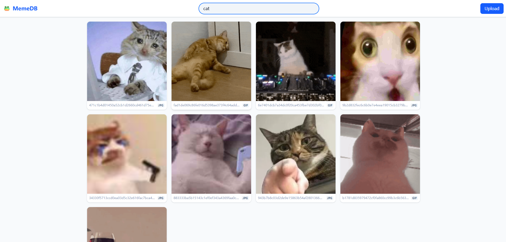

# 🐸 MemeDB


**MemeDB** is a high-performance, full-stack meme management solution designed for local image organization. It comes with a **Rust** backend server with extreme efficiency and a **React** UI with modern user experience.

## Introduction
I wrote this because I have too many memes and the social media I use has been putting too many restrictions on storing pictures.

## How to use

### Option 1: One-Click Deployment (Recommended)
This project includes a bootstrap script for automated environment setup.

1.  Clone this repository.
2.  Run the setup script:
    ```bash
    chmod +x setup.sh
    ./setup.sh
    ```
3.  Visit `http://localhost:8081` in your browser.

*(Note: Requires Docker & Docker Compose installed)*

### Option 2: Manual Development
For developers who want to contribute or debug:
- **Backend**: Run `cargo run` in the root directory.
- **Frontend**: Run `npm run dev` in the `ui` directory.

## Features
- **🏷️ Tagging System**: Allows tagging pictures and searching by tags
- **🔍 Instant Search**: Real-time filtering by tags.
- **💾 Content-Addressable Storage (CAS)**:
    - Implements **SHA256** hashing to automatically detect and reject duplicate file uploads (Strict Deduplication).
    - *Note: Currently supports exact file match. Perceptual hashing (pHash) for similar image detection is planned for future*
- **📦 Containerized**: Optimized Docker images using **Multi-stage builds**, separating the build environment from the lean runtime environment.

## Screenshots
| Home Page & Search | Image Details & Management |
|:---:|:---:|
|| |

## Tech Stack

### Backend
- **Language**: Rust
- **Web Framework**: Axum
- **Database**: SQLx + SQLite(Async, pure Rust SQL crate with **compile-time checked queries**)
- **Runtime**: Tokio

### Frontend
- **Language**: Typescript
- **Framework**: React 19
- **Build Tool**: Vite
- **Styling**: Tailwind CSS V4

### Infrastructure
- **Containerization**: Docker & Docker Compose
- **Scripting**: Bash (for automation)

---
For more implementation details, please refer to [design.md](./design.md).
